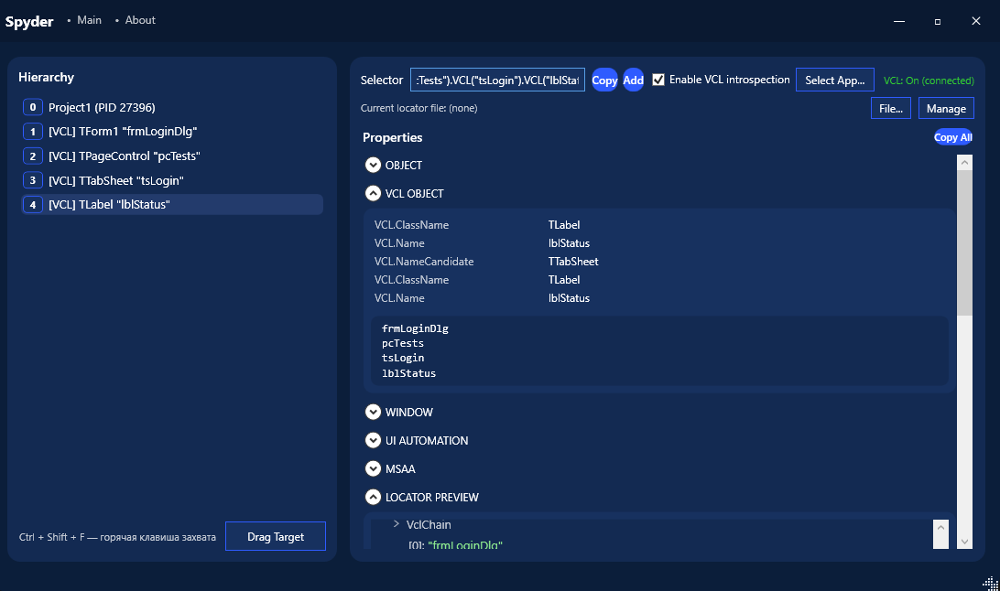

<h1 align="center">
  <picture>
    <source media="(prefers-color-scheme: dark)" srcset="docs/images/spyder-inverse.svg">
    <source media="(prefers-color-scheme: light)" srcset="docs/images/spyder.svg">
    
  </picture>
</h1>

  
  
  
  
  
  

**Spyder** is a modern object inspection tool for **VCL desktop applications**.

It enables reliable UI automation by extracting the **real VCL component hierarchy** directly from application memory.

The project is designed for automation engineers working with legacy Windows systems where standard UI automation frameworks fail.

Spyder provides the missing tooling for desktop automation similar to what browser DevTools provide for web testing.

---
## Spyder Inspector

## Why Spyder

Many modern automation frameworks focus on:

- Web applications
- APIs
- Mobile platforms

However a huge amount of enterprise software still runs on **Windows desktop frameworks like VCL**.

Spyder brings modern automation capabilities to these systems.

---

### 🔥 Features

- Deep **VCL component introspection**
- Automatic **32 / 64 bit process detection**
- Hover based **control inspection**
- Access to real **TComponent.Name**
- Extraction of **VCL component tree**
- Reliable selector generation
- JSON locators for automation frameworks

---

### 🔥 Getting Started

---

## License

Spyder is licensed under the Apache 2.0 License.
