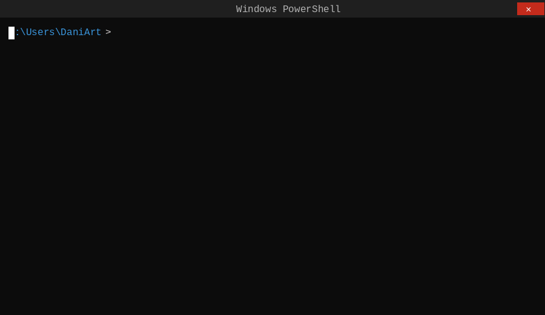

<h1 align="center">
  <picture>
    <source media="(prefers-color-scheme: dark)" srcset="docs/images/spyder-inverse.svg">
    <source media="(prefers-color-scheme: light)" srcset="docs/images/spyder.svg">
    
  </picture>
</h1>

<p align="center">
  <a href="LICENSE">
    
  </a>
  <a href="https://github.com/DaniArt/Spyder">
    
  </a>
  <a href="https://github.com/DaniArt/Spyder">
    
  </a>
  <a href="https://github.com/DaniArt/Spyder">
    
  </a>
  <a href="https://github.com/DaniArt/Spyder">
    
  </a>
  <a href="https://github.com/DaniArt/Spyder">
    
  </a>
</p>

**Spyder** is a UI inspection and locator authoring tool for **Windows desktop applications**.

Most automation frameworks work with web, mobile, or APIs. A large portion of enterprise software still runs on **legacy Windows stacks like Delphi/VCL**, where standard tools break down or simply cannot see inside the component tree at all. Spyder fills that gap.

It extracts the real VCL component hierarchy directly from application memory, including controls that have no HWND of their own, and produces stable selectors and structured locators that your automation code can actually rely on. Think of it as DevTools for desktop.

---

## 🕷️ Spyder Inspector


---

## 🔍 How It Works

Spyder runs a layered capture pipeline with multiple backends. If one fails, the others still produce output.

```text
Spy.UI (WPF)
  ├── capture modes: hover / hotkey / drag
  ├── overlay highlight rendering
  └── locator.json management

Spy.Core
  ├── Win32 / UIA / MSAA capture with timeouts
  ├── selector + structured locator building
  └── VCL hook lifecycle (optional)

Target Process (injected, optional)
  ├── Named Pipe server (JSON RPC)
  ├── UI-thread dispatch via message-loop hook
  └── VCL bridge + Delphi helper DLL
```

**Base mode** works out of the box via Win32, UIA, and MSAA.

**VCL mode** injects a native subsystem into the target process and exposes the real Delphi component tree, including `TComponent.Name`, non-HWND controls like `TSpeedButton`, and the full hierarchy up to the form root.

---

## 🔥 Features

- Deep **VCL component introspection** from live process memory
- Automatic **32-bit process detection**
- Hover-based **control highlight** with click-through overlay
- Access to real **TComponent.Name** and VCL chain
- Extraction of full **VCL component tree**
- **Multi-backend capture**: Win32, UIA, MSAA, VCL
- Stable **selector generation**
- Versioned **JSON locators** for automation frameworks

---

## 👉 Quick Start

<p>

</p>

**1. Prerequisites**

- Windows
- [.NET SDK 8](https://dotnet.microsoft.com/download)
- *(Optional, for VCL mode)* C++ and Delphi toolchains

**2. Clone and build**

```powershell
git clone https://github.com/DaniArt/Spyder.git
cd Spyder
dotnet restore
dotnet build .\Spy.UI\Spyder.csproj -c Debug
```

**3. Build native VCL artifacts** *(optional)*

```powershell
cd VclHook
.\BuildSpyderVclHelper32.bat
.\BuildAll-x86.bat
```

Artifacts produced in `VclHook/`:
- `VclHook32.dll`
- `VclHookLoader32.dll`
- `SpyderVclHelper32.dll`

**4. Publish self-contained**

```powershell
dotnet publish .\Spy.UI\Spyder.csproj -c Release -r win-x86 --self-contained true -p:PublishSingleFile=true
```

Output: `Spy.UI\bin\Release\net8.0-windows\win-x86\publish\Spyder.exe`

Place the three native DLLs from step 3 next to `Spyder.exe`.

---

## ⚡ Workflow

1. Launch `Spyder.exe`
2. *(Optional)* Enable VCL introspection and pick the target process
3. Hover over any control to see the highlight and live metadata
4. Capture via hotkey or drag mode
5. Review the selector and component properties
6. Save the entry to `locator.json`

---

## 📄 Locator Output

Spyder saves captured elements to a versioned JSON file that can be committed to source control.

```json
{
  "schema_version": 1,
  "elements": {
    "login.button": {
      "human_selector": "App(\"ExampleApp\").Form(\"TMainForm\").Button(\"btnLogin\")",
      "locator": {
        "backendPriority": ["vcl", "uia", "win32", "msaa"],
        "process": "ExampleApp",
        "vclChain": ["TMainForm", "pnlClient", "btnLogin"],
        "uia": { "controlType": "Button", "name": "Login" },
        "win32": { "className": "Button", "text": "Login" }
      },
      "description": "Login button on main form",
      "updated_at": "2026-03-20T03:05:22.123Z"
    }
  }
}
```

---

## 📌 Compatibility

| Requirement | Details |
|---|---|
| OS | Windows only |
| Runtime | .NET 8 (`net8.0-windows`) |
| Architecture | x86 (x64 in progress) |
| VCL mode | Requires native artifacts + bitness match with target |
| VCL targets | Delphi/VCL applications (32-bit) |

Spyder must match the bitness of the target process for VCL introspection to work.

---

## ⚠️ Limitations

- Windows desktop only, no cross-platform support
- VCL introspection is an optional, target-specific subsystem
- x64 target support is not yet complete
- Some VCL backends are best-effort and may degrade under heavy UI activity
- Not a general-purpose UI automation framework

---

## 📖 Documentation

| Document | Description |
|---|---|
| [Overview](docs/en/overview.md) | Capabilities and typical scenarios |
| [Installation](docs/en/installation.md) | Full build and deploy instructions |
| [Quick Start](docs/en/quick-start.md) | End-to-end in 5 steps |
| [Architecture](docs/en/architecture.md) | Layer diagram and data flow |
| [Components](docs/en/components.md) | Per-component responsibilities |
| [Locator Format](docs/en/locator-format.md) | `locator.json` schema reference |
| [Pipe Protocol](docs/en/pipe-protocol.md) | Named Pipe IPC details |
| [VCL Internals](docs/en/internals-vcl.md) | How VCL introspection works |
| [Repository Structure](docs/en/repository-structure.md) | File tree walkthrough |
| [FAQ](docs/en/faq.md) | Common issues and answers |

Also available in [Русский](docs/ru/) and [Español](docs/es/).

---

## 🗺️ Roadmap

| Area | Status |
|---|---|
| UI capture (hover, hotkey, drag) | Stable |
| Win32 / UIA / MSAA backends | Stable |
| Overlay highlight | Stable |
| Selector generation | Stable |
| `locator.json` persistence | Stable |
| VCL introspection (x86) | Active development |

---

## 🙋 Contributing

See [CONTRIBUTING.md](CONTRIBUTING.md).  
File bugs and feature requests via [Issues](https://github.com/DaniArt/Spyder/issues).

When reporting a bug, enable file logging (`%LOCALAPPDATA%\Spyder\logs\spyder.log`) and attach the log.

---

## 🔐 Security

If you find a security issue, please do not open a public GitHub issue. Report it directly via [GitHub Issues](https://github.com/DaniArt/Spyder/issues) with a private disclosure, or contact the maintainer directly. We appreciate responsible disclosure.

---

## 🔓 License

Spyder is licensed under the [Apache 2.0 License](LICENSE).
